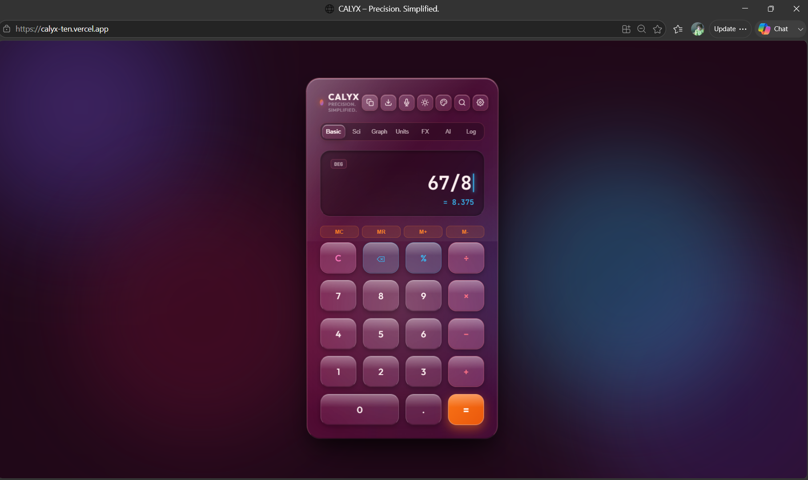
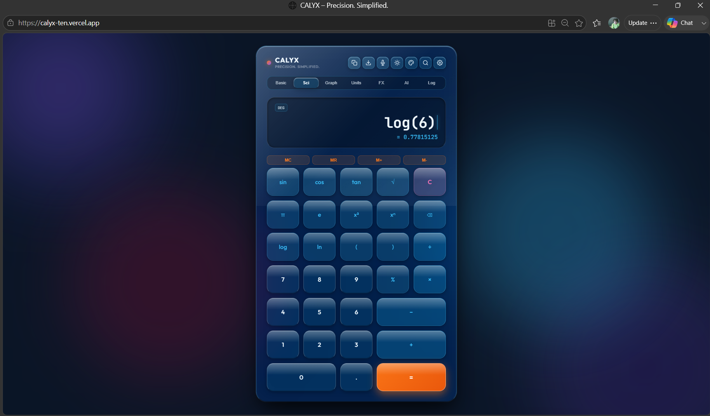
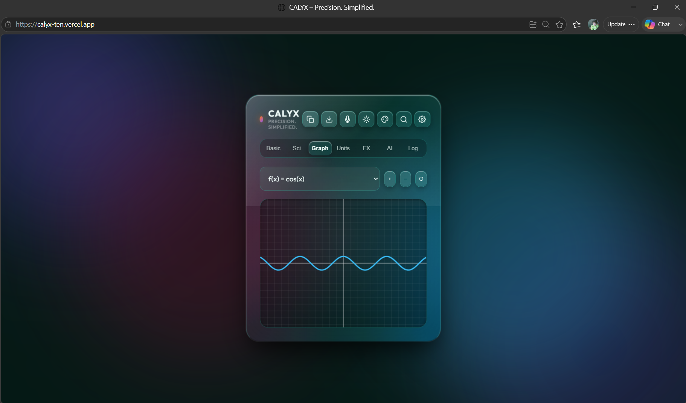
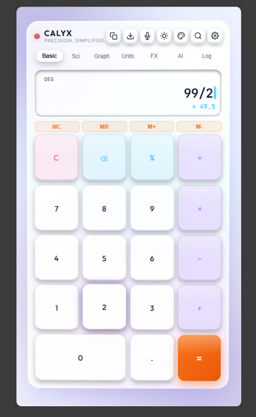

<div align="center">

# 🧮 CALYX

### *Designed for the Future.*

A premium VisionOS-inspired scientific calculator built with **HTML, CSS, and JavaScript**, featuring a modern glassmorphism interface, responsive design, and advanced productivity tools.


🌐 **Live Demo:** https://calyx-ten.vercel.app/

</div>

---

# ✨ Overview

CALYX is a premium web-based calculator inspired by Apple's VisionOS design language. It combines elegant glassmorphism, smooth animations, and advanced calculation tools into a clean and modern interface.

Designed as a portfolio-quality frontend project, CALYX demonstrates responsive UI design, modern CSS techniques, and interactive JavaScript functionality.

---

# 🚀 Features

- VisionOS-inspired Glassmorphism UI
- Basic Calculator
- Scientific Calculator
- Interactive Graph Mode
- Unit Converter
- Currency Converter
- AI Math Assistant
- Calculation History
- Multiple Themes
- Voice Input
- Keyboard Shortcuts
- Smooth Animations
- Responsive Design
- Dark Theme
- Desktop-like Experience

---

# 🖼️ Screenshots

## Home

<p align="center">
  
</p>

---

## Scientific Mode

<p align="center">
  
</p>

---

## Graph Mode

<p align="center">
  
</p>

---

## Mobile View

<p align="center">
  
</p>

---

# 🛠️ Tech Stack

| Technology | Purpose |
|------------|---------|
| HTML5 | Structure |
| CSS3 | Styling & Glassmorphism |
| JavaScript (ES6) | Functionality |
| Vercel | Deployment |
| Git & GitHub | Version Control |

---

# 📂 Project Structure

```text
CALYX
│
├── index.html
├── style.css
├── script.js
├── manifest.json
├── assets/
│   ├── screenshots/
│   └── icons/
└── README.md
```

---

# 🚀 Running Locally

Clone the repository

```bash
git clone https://github.com/Aadya1210/Calyx--Calculator.git
```

Go into the project

```bash
cd Calyx--Calculator
```

Run using Live Server or any static server.

---

# 🌍 Live Website

https://calyx-ten.vercel.app/

---

# 🎯 Future Improvements

- Offline PWA Support
- Better AI Assistant
- Financial Calculator
- Statistics Mode
- Matrix Calculator
- Equation Solver
- Programmer Mode
- Unit Tests
- Localization

---

# 📜 License

This project is licensed under the MIT License.

---

# 👩‍💻 Author

**Aadya Srivastava**

GitHub: https://github.com/Aadya1210

---

<div align="center">

### ⭐ If you enjoyed this project, consider giving it a star!


</div>
